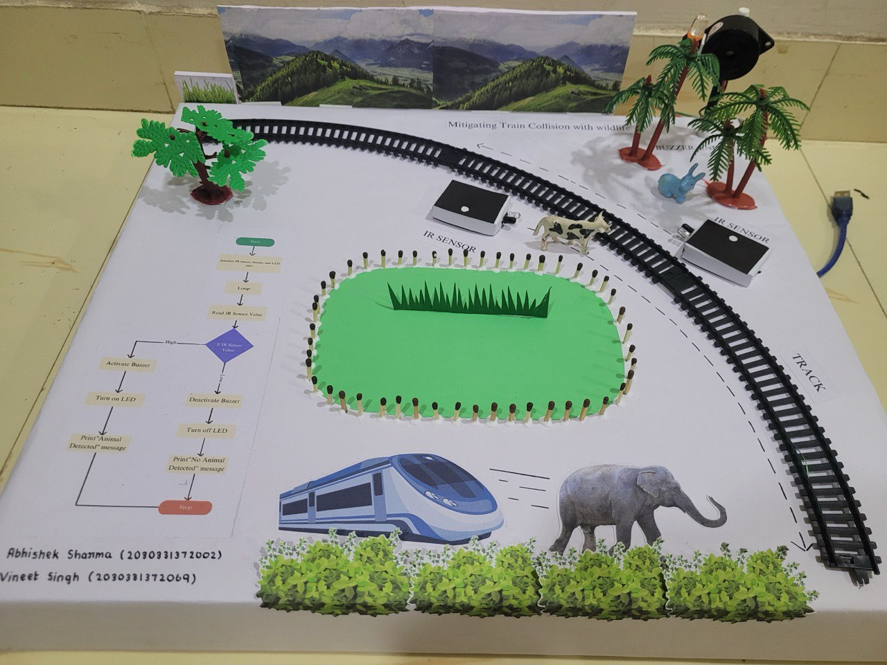

# 🌟 Mitigating Railway Collision with Wildlife 🌟

## Project Overview

This project aims to develop an animal detection system for railway tracks using IR sensors, a buzzer, and LEDs. The system uses an Arduino microcontroller to detect the presence of animals and provide timely alerts to train operators, thereby preventing train-animal collisions and ensuring the safety of both animals and passengers.

## Objectives

- **Design a hardware system** using Arduino, IR sensors, a buzzer, and LEDs.
- **Develop an algorithm** to process sensor data and trigger alerts.
- **Implement the system** on a test track to evaluate performance and accuracy.
- **Analyze results** and make necessary improvements.
- **Provide recommendations** for deployment on real-world railway tracks.

## Components

- **Arduino Board**: Central processing unit, controls the system.
- **IR Sensors**: Detect the presence of animals on the tracks.
- **Buzzer**: Provides audible alerts when an animal is detected.
- **LEDs**: Provide visual alerts when an animal is detected.
- **Power Supply**: Ensures reliable operation of the components.

## System Architecture

The system architecture consists of the following components:

1. **IR Sensor Module**: Detects animals on the railway tracks.
2. **Arduino Microcontroller**: Processes sensor data and controls the buzzer and LEDs.
3. **Buzzer**: Emits sound to alert the train operator.
4. **LEDs**: Light up to provide visual alerts.
5. **Power Supply**: Provides necessary voltage and current to the system.

## Hardware Design

### Component Selection

Components are selected based on technical specifications, compatibility, and reliability. Key factors include range, sensitivity, power requirements, and durability.

### System Layout

The layout ensures optimal coverage of the railway track and efficient detection of animals. Proper positioning and orientation of IR sensors, buzzer, and LEDs maximize effectiveness.

### Power Supply

A reliable power supply system is designed to provide the necessary voltage and current. It includes mechanisms to protect against voltage fluctuations and power surges.

## Software Design

### Arduino Programming

The Arduino is programmed using C/C++. The code includes functions for:
- Reading sensor data.
- Implementing threshold and sensitivity algorithms.
- Controlling the buzzer and LEDs.
- Handling communication with external devices if required.

### Sensor Data Processing

Algorithms process sensor data to determine the presence of animals. This involves:
- Calibrated sensitivity and threshold levels.
- Filtering techniques.
- Decision-making logic.

### Alert Triggering

The code activates the buzzer and LEDs when an animal is detected. The timing and duration of the alerts are controlled to provide clear indications of potential hazards.

## System Integration and Configuration

### Component Assembly

Components, including the Arduino board, IR sensors, buzzer, and LEDs, are physically connected and mounted according to the system layout.

### Configuration

The software code is uploaded to the Arduino microcontroller, and the system is tested for functionality and performance.

## Implementation Steps

1. **Research and Literature Review**: Study existing systems and technologies.
2. **System Design**: Develop system architecture and select components.
3. **Sensor Calibration and Testing**: Ensure accurate detection of animals.
4. **System Implementation**: Assemble hardware and program the Arduino.
5. **Performance Evaluation**: Test the system on a test track and analyze results.
6. **Optimization and Enhancement**: Improve system efficiency and performance.

## Safety Considerations

- **Compliance with safety standards**.
- **Hazard analysis** to identify potential risks.
- **Mitigation strategies** to address identified hazards.
- **Regular maintenance** to ensure system reliability.

## Media

### Photos

### Videos

[Watch the system in action](Media/Railway.mp4)

## Conclusion

This project provides a comprehensive solution to mitigate train collisions with animals by detecting their presence on railway tracks and alerting train operators. Future work will focus on enhancing the system's capabilities and deploying it in real-world scenarios.

## References

- [Arduino](https://www.arduino.cc/)
- [IR Sensor Technology](https://en.wikipedia.org/wiki/Infrared_sensor)
- Relevant academic papers and articles.
